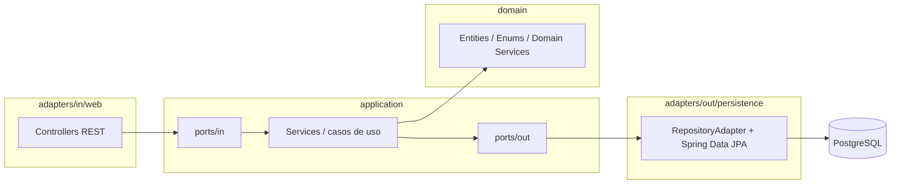
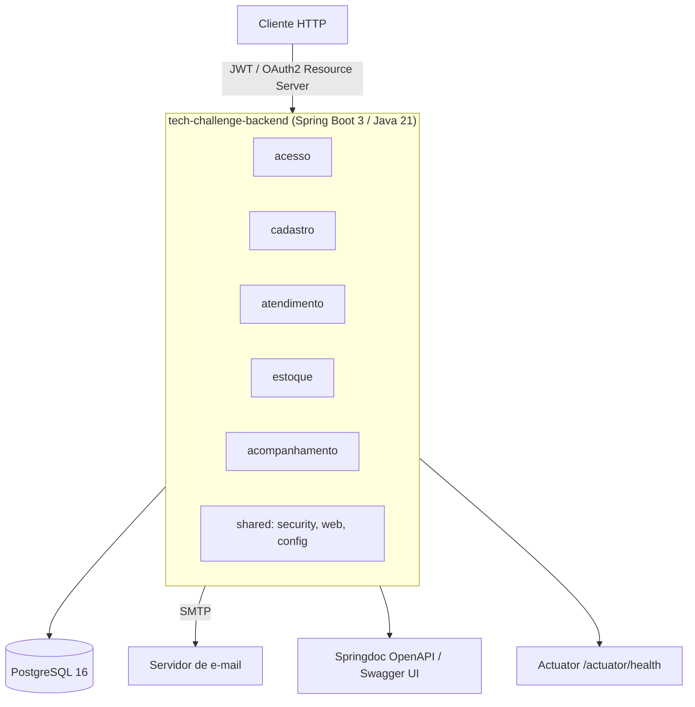
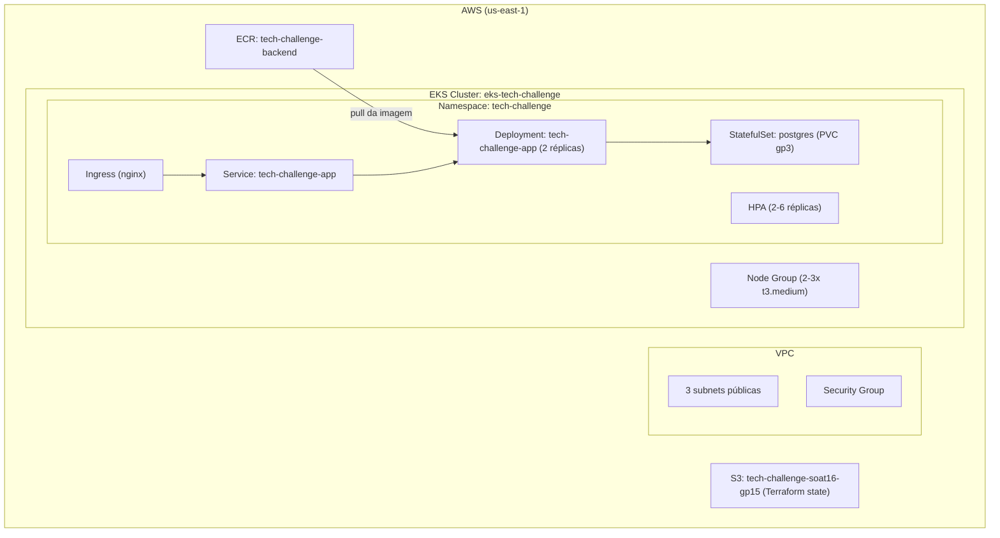
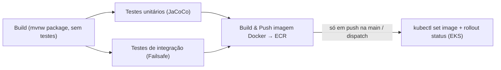
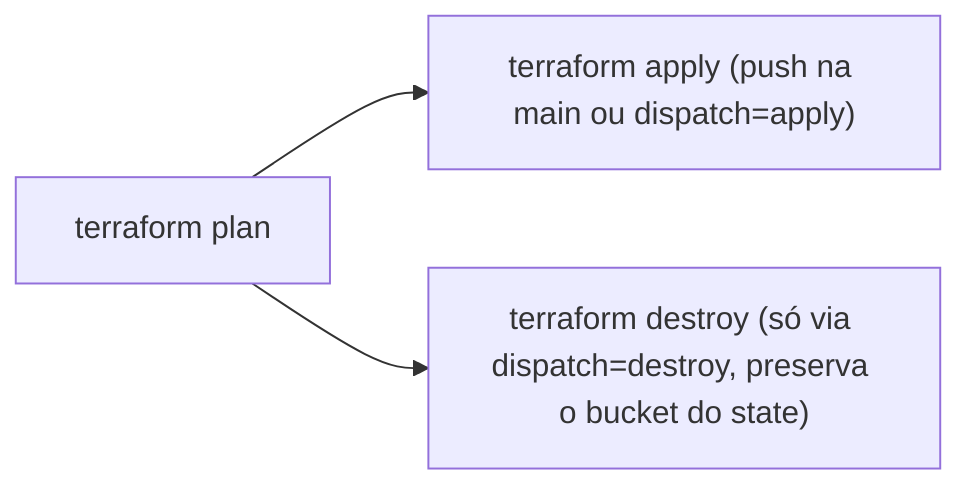

# Tech Challenge — Grupo 15 (postech-16SOAT)

Projeto da pós-graduação em Arquitetura de Software (FIAP/SOAT) — **Fase 2**.

API REST para gerenciamento de ordens de serviço de uma oficina mecânica, construída em
Java 21 / Spring Boot 3, seguindo Clean Architecture. Todo o código-fonte, os manifests
Kubernetes e o Terraform da infraestrutura estão em [`tech-challenge-backend/`](tech-challenge-backend/).

## 🎥 Vídeo de demonstração

**[Demonstração da Fase 2 — YouTube](https://www.youtube.com/watch?v=79YrCSF7ioA)**

O vídeo mostra, na prática:

- As **novas funcionalidades** entregues nesta fase;
- Os **pipelines de CI/CD** no GitHub Actions (build, testes e deploy da aplicação; `plan`/`apply` da infraestrutura);
- O provisionamento da infraestrutura com **Terraform** (VPC, cluster EKS, node group, ECR e backend de state no S3);
- A aplicação em execução no **Kubernetes (Amazon EKS)** a partir dos manifestos de [`tech-challenge-backend/k8s/`](tech-challenge-backend/k8s/) — Deployment, Service, Ingress, HPA, PDB e o StatefulSet do PostgreSQL.

## 📋 Índice

- [🎥 Vídeo de demonstração](#-vídeo-de-demonstração)
- [1. Descrição da solução e objetivos da Fase 2](#1-descrição-da-solução-e-objetivos-da-fase-2)
- [2. Arquitetura](#2-arquitetura)
  - [2.1. Componentes da aplicação](#21-componentes-da-aplicação)
  - [2.2. Infraestrutura provisionada](#22-infraestrutura-provisionada)
  - [2.3. Fluxo de deploy (CI/CD)](#23-fluxo-de-deploy-cicd)
- [3. Instruções](#3-instruções)
  - [3.1. Execução local](#31-execução-local)
  - [3.2. Deploy em Kubernetes (local, com Kind)](#32-deploy-em-kubernetes-local-com-kind)
  - [3.3. Provisionamento da infraestrutura com Terraform (AWS)](#33-provisionamento-da-infraestrutura-com-terraform-aws)
- [Endpoints principais](#-endpoints-principais)
- [Solução de problemas comuns](#-solução-de-problemas-comuns)

---

## 1. Descrição da solução e objetivos da Fase 2

O sistema (`tech-challenge-backend`) é uma API REST para uma oficina mecânica, cobrindo:

- **Autenticação e controle de acesso** (usuários, JWT);
- **Cadastro** de clientes e veículos;
- **Criação e acompanhamento de ordens de serviço (OS)**, com itens de serviço/peça
  e histórico de status;
- **Orçamentos**: criação, aprovação/rejeição (inclusive via link público enviado
  por e-mail);
- **Controle de estoque** de peças e insumos, com movimentações de entrada/saída;
- **Relatórios** de ordens de serviço (geração de PDF via iText).

Na **Fase 1** o foco foi a modelagem do domínio e da API. Na **Fase 2**, os objetivos
documentados neste repositório são:

- Empacotar a aplicação em **container Docker**;
- Descrever a infraestrutura como código (**Terraform**) para um cluster **Kubernetes
  gerenciado (Amazon EKS)**, incluindo rede, cluster, node group e registry de imagens
  (**ECR**);
- Publicar manifestos **Kubernetes** (Deployment, Service, Ingress, HPA, PDB,
  StatefulSet do banco) reutilizáveis tanto localmente (Kind) quanto no EKS;
- Automatizar build, testes e deploy contínuo via **GitHub Actions** (pipeline de
  aplicação e pipeline de Terraform separados).

## 2. Arquitetura

### 2.1. Componentes da aplicação

O código em `tech-challenge-backend/src/main/java/.../tech_challenge_backend` é
organizado por **módulo de negócio** (bounded context); cada módulo segue Clean
Architecture / ports & adapters com as camadas `domain` → `application` → `adapters`:

| Módulo | Camadas presentes | Responsabilidade |
|---|---|---|
| `acesso` | `domain`, `application`, `adapters` | Autenticação e emissão de JWT |
| `cadastro` | `domain`, `application`, `adapters` | Clientes e veículos |
| `atendimento` | `domain`, `application`, `adapters` | Ordens de serviço, itens, orçamento, relatórios |
| `estoque` | `domain`, `application`, `adapters` | Peças/insumos e movimentações |
| `acompanhamento` | `application`, `adapters` | Consulta do andamento das OS pelo cliente |
| `shared` | `domain`, `application`, `infrastructure` | Código transversal (`security/`, `web/`, `config/`) |

Dentro de cada módulo:

- `domain/entities|enums|exceptions|services`: regras de negócio, sem dependência de
  frameworks;
- `application/dto|ports/in|ports/out|services|exceptions`: casos de uso e as portas
  (interfaces) de entrada/saída;
- `adapters/in/web`: controllers REST (entrada);
- `adapters/out/persistence` (`...RepositoryAdapter.java`): adaptadores JPA para as
  portas de saída.





**Stack real** (de [`tech-challenge-backend/pom.xml`](tech-challenge-backend/pom.xml)):

| Tecnologia | Versão/uso |
|---|---|
| Java | 21 |
| Spring Boot | 3.5.15-SNAPSHOT (`spring-boot-starter-parent`) |
| Spring Web, Data JPA, Validation, Security, OAuth2 Resource Server, Actuator | via starters |
| PostgreSQL | driver `org.postgresql:postgresql` (runtime) |
| Flyway | 11.7.2 (`flyway-core`, `flyway-database-postgresql`) — migrações em `src/main/resources/db/migration` |
| Springdoc OpenAPI (Swagger UI) | 2.8.16 |
| Lombok | 1.18.38 |
| iText (kernel/layout) | 7.2.5 — geração de relatórios em PDF |
| Spring Boot Starter Mail | notificações por e-mail |
| H2 | dependência de teste |
| Testcontainers (`spring-boot-testcontainers`, `postgresql`, `junit-jupiter`) | testes de integração |
| Cucumber (`cucumber-java`, `cucumber-junit-platform-engine`, `cucumber-spring`) 7.18.1 | testes BDD, features em `src/test/resources/features` |
| WireMock (`wiremock-standalone`, `wiremock-jre8`) + `spring-cloud-contract-wiremock` | mocks de integrações externas |
| ArchUnit | 1.3.0 — fitness functions de arquitetura (`src/test/java/.../architecture`) |
| JaCoCo | 0.8.12 — cobertura, publicada no SonarCloud |

### 2.2. Infraestrutura provisionada

Terraform em [`tech-challenge-backend/infra/`](tech-challenge-backend/infra/) provisiona,
na AWS (região `us-east-1`, ver `vars.tf`):

- **Rede**: 1 VPC (`vpc.tf`, CIDR configurável), 3 subnets públicas, Internet Gateway,
  tabela de rotas e Security Group (ingress HTTP liberado);
- **EKS**: cluster `eks-tech-challenge` (versão `1.36`, autenticação via *Access
  Entry* API — `eks-cluster.tf`), Node Group `nodeg-tech-challenge` com 2–3 nós
  `t3.medium` (`eks-node.tf`) e um Launch Template dedicado (IMDS hop limit 2, exigido
  pelo addon EBS CSI);
- **ECR**: repositório `tech-challenge-backend` com scan automático de imagem e
  política de lifecycle que mantém só as 5 imagens mais recentes (`ecr.tf`);
- **Addon EKS**: `aws-ebs-csi-driver` (`k8s-ebs-csi-addon.tf`), necessário para a
  StorageClass usada pelo PostgreSQL;
- **State remoto**: backend S3 (`backend.tf`, bucket `tech-challenge-soat16-gp15`),
  cujo próprio bucket é criado por um módulo Terraform interno (`backend/`,
  `state-bucket.tf`);
- **Recursos Kubernetes** (`k8s-*.tf`): aplicam, via provider `kubectl`, os mesmos
  manifests de `../k8s/` dentro do cluster EKS — Namespace, ConfigMap, Secret (gerado
  a partir das variáveis sensíveis do Terraform, não do `secret.yaml`), StorageClass,
  Service + StatefulSet do Postgres, Service + Deployment da app (troca a tag da
  imagem local pela do ECR), HPA, Ingress, PodDisruptionBudget e `metrics-server`.

Detalhes recurso a recurso em
[`tech-challenge-backend/infra/README.md`](tech-challenge-backend/infra/README.md) e
[`tech-challenge-backend/k8s/README.md`](tech-challenge-backend/k8s/README.md).

Manifestos Kubernetes em [`tech-challenge-backend/k8s/`](tech-challenge-backend/k8s/)
(namespace `tech-challenge`; também usados localmente via Kustomize):

| Arquivo | Recurso |
|---|---|
| `namespace.yaml` | Namespace `tech-challenge` |
| `configmap.yaml` / `secret.yaml` | Configuração não sensível / credenciais (placeholders no fluxo local) |
| `postgres-statefulset.yaml` + `postgres-service.yaml` | PostgreSQL com PVC (StorageClass `gp3`) |
| `app-deployment.yaml` | Deployment `tech-challenge-app`, 2 réplicas, probes em `/actuator/health`, requests 250m/512Mi e limits 1000m/1024Mi |
| `app-service.yaml` | Service `ClusterIP`, porta 80 → 8080 |
| `app-ingress.yaml` | Ingress (classe `nginx`, host `tech-challenge.local`) |
| `app-hpa.yaml` | HPA: 2–6 réplicas, alvo 70% CPU / 75% memória |
| `app-pdb.yaml` | PodDisruptionBudget |
| `storage-class.yaml`, `metrics-server.yaml` | Específicos do EKS (aplicados só via Terraform) |
| `kustomization.yaml` | Amarra os recursos para `kubectl apply -k` |



### 2.3. Fluxo de deploy (CI/CD)

CI/CD em [`.github/workflows/`](.github/workflows/), com pipelines independentes:

**`pipeline.yml`** — build, testes e deploy da aplicação (push/PR em `main`):



- `build-and-push-image` e `deploy` só rodam em push na `main` ou `workflow_dispatch`
  (nunca em `pull_request`);
- a imagem é publicada no ECR com a tag `${{ github.sha }}` e também como `latest`;
- o deploy atualiza a imagem do `Deployment` já existente no namespace
  `tech-challenge` do cluster `eks-tech-challenge` e aguarda o rollout
  (`kubectl rollout status`).

**`terraform.yml`** — infraestrutura (push em `main` que altera `infra/` ou `k8s/`, ou
`workflow_dispatch` com `plan`/`apply`/`destroy`):



**`sonar.yml`** — análise estática (push em `main`/`feature/**`): roda
`./mvnw verify org.sonarsource.scanner.maven:sonar-maven-plugin:sonar` publicando no
SonarCloud (`projectKey=Grupo15_postech-16SOAT`).

---

## 3. Instruções

### 3.1. Execução local

Todos os comandos abaixo são executados dentro de `tech-challenge-backend/`
(`cd tech-challenge-backend`).

#### Pré-requisitos

**Obrigatório:**
- **Java 21** - [Download](https://adoptium.net/)
- **Docker** (para executar com containers) - [Download](https://www.docker.com/products/docker-desktop)
- **Docker Compose** - Incluído no Docker Desktop

**Opcional (para rodar sem Docker):**
- **PostgreSQL 16** - [Download](https://www.postgresql.org/download/)
- **Maven 3.8+** - [Download](https://maven.apache.org/)

#### Opção 1: Com Docker Compose (Recomendado)

Mais simples e garante que o ambiente esteja correto.

##### 1. Preparar variáveis de ambiente
```bash
cp .env.example .env
```

O arquivo `.env` padrão já contém os valores necessários:
```env
DB_NAME=tech_challenge
DB_USER=postgres
DB_PASS=postgres
```

##### 2. Iniciar a aplicação
```bash
docker compose up --build
```

Aguarde até ver mensagens indicando que a aplicação está pronta:
- PostgreSQL: `database system is ready to accept connections`
- WireMock: `WireMock started`
- Aplicação: `Started TechChallengeBackendApplication`

##### 3. Acessar a aplicação
- **API**: [http://localhost:8080](http://localhost:8080)
- **Swagger UI**: [http://localhost:8080/swagger-ui.html](http://localhost:8080/swagger-ui.html)
- **Health Check**: [http://localhost:8080/ping](http://localhost:8080/ping)
- **MailHog (e-mails enviados em dev)**: [http://localhost:8025](http://localhost:8025)

##### 4. Parar a aplicação
```bash
docker compose down
```

Para remover os volumes (dados do banco também):
```bash
docker compose down -v
```

---

#### Opção 2: Banco em Docker + Aplicação Local

Útil para desenvolvimento e debug.

##### 1. Iniciar apenas o banco de dados
```bash
docker compose up postgres wiremock -d
```

Aguarde 10-15 segundos para o banco inicializar.

##### 2. Configurar variáveis de ambiente locais

**Em Windows (PowerShell):**
```powershell
$env:SPRING_DATASOURCE_URL = "jdbc:postgresql://localhost:5433/tech_challenge"
$env:SPRING_DATASOURCE_USERNAME = "postgres"
$env:SPRING_DATASOURCE_PASSWORD = "postgres"
```

**Em Linux/Mac (Bash):**
```bash
export SPRING_DATASOURCE_URL=jdbc:postgresql://localhost:5433/tech_challenge
export SPRING_DATASOURCE_USERNAME=postgres
export SPRING_DATASOURCE_PASSWORD=postgres
```

Ou copie o `.env` e use em sua IDE.

##### 3. Executar a aplicação

**Via Maven:**
```bash
./mvnw spring-boot:run
```

Ou no Windows:
```bash
mvnw.cmd spring-boot:run
```

**Via IDE:**
- Abra o projeto em sua IDE (IntelliJ, Eclipse, VS Code)
- Configure o Java 21 como JDK
- Execute `TechChallengeBackendApplication.main()`

##### 4. Acessar a aplicação
- **API**: [http://localhost:8080](http://localhost:8080)
- **Swagger UI**: [http://localhost:8080/swagger-ui.html](http://localhost:8080/swagger-ui.html)

##### 5. Parar a aplicação
Pressione `Ctrl+C` no terminal
```bash
docker compose down
```

---

#### Opção 3: Tudo Local (sem Docker)

##### 1. Configurar PostgreSQL

**No Windows (usando pgAdmin ou psql):**
```sql
CREATE DATABASE tech_challenge;
```

**No Linux/Mac:**
```bash
createdb -h localhost -U postgres -p 5432 tech_challenge
```

##### 2. Configurar variáveis de ambiente

**Windows (PowerShell):**
```powershell
$env:SPRING_DATASOURCE_URL = "jdbc:postgresql://localhost:5432/tech_challenge"
$env:SPRING_DATASOURCE_USERNAME = "postgres"
$env:SPRING_DATASOURCE_PASSWORD = "postgres"
```

**Linux/Mac (Bash):**
```bash
export SPRING_DATASOURCE_URL=jdbc:postgresql://localhost:5432/tech_challenge
export SPRING_DATASOURCE_USERNAME=postgres
export SPRING_DATASOURCE_PASSWORD=postgres
```

##### 3. Executar a aplicação
```bash
./mvnw spring-boot:run
```

##### 4. Migrações de banco
As migrações são executadas automaticamente via Flyway na inicialização.

---

## 🔌 Verificar se está funcionando

### Endpoint de Health Check
```bash
curl http://localhost:8080/ping
```

Resposta esperada:
```json
{
  "status": "ok",
  "db": "PostgreSQL 16.x on x86_64-pc-linux-musl, compiled by gcc (GCC) 12.2.0, 64-bit"
}
```

### Acessar Swagger UI
Abra no navegador: [http://localhost:8080/swagger-ui.html](http://localhost:8080/swagger-ui.html)

---

## 📚 Estrutura do Projeto

```
src/
├── main/
│   ├── java/com/fiap/tech_challenge_backend/
│   │   ├── acesso/                          # Módulo de autenticação
│   │   │   ├── domain/
│   │   │   ├── application/                 # ports/in, ports/out, services, dto, exceptions
│   │   │   └── adapters/                    # in/web (controllers), out (persistence, infra)
│   │   │
│   │   ├── cadastro/                        # Módulo de clientes e veículos
│   │   │   ├── domain/
│   │   │   ├── application/
│   │   │   └── adapters/
│   │   │
│   │   ├── atendimento/                     # Módulo de ordens, orçamentos e relatórios
│   │   │   ├── domain/
│   │   │   ├── application/
│   │   │   └── adapters/
│   │   │
│   │   ├── estoque/                         # Módulo de peças e insumos
│   │   │   ├── domain/
│   │   │   ├── application/
│   │   │   └── adapters/
│   │   │
│   │   ├── acompanhamento/                  # Módulo de acompanhamento (bounded context de leitura)
│   │   │   ├── application/
│   │   │   └── adapters/
│   │   │
│   │   ├── config/                          # Configurações gerais (ex.: Swagger)
│   │   │
│   │   ├── shared/                          # Código compartilhado
│   │   │   ├── domain/                      # value objects
│   │   │   ├── application/                 # dto, exceptions
│   │   │   └── infrastructure/              # security, web (GlobalExceptionHandler), config
│   │   │
│   │   └── TechChallengeBackendApplication.java
│   │
│   └── resources/
│       ├── application.yml                  # Configurações principais
│       ├── application-dev.yml
│       ├── application-test.yml
│       └── db/
│           └── migration/                   # Scripts SQL do Flyway
│
├── test/
│   ├── java/
│   │   ├── acesso/ … estoque/               # Testes espelham a estrutura de main/ por módulo (unitários e *ControllerIT lado a lado)
│   │   ├── architecture/                    # Testes de arquitetura (ArchUnit)
│   │   ├── config/                          # Configurações de segurança para testes
│   │   └── cucumber/                        # Testes BDD
│   │
│   └── resources/
│       ├── features/                        # Cenários Gherkin
│       ├── wiremock/                        # Configurações WireMock
│       └── archunit.properties              # Configuração da baseline do ArchUnit
│
├── pom.xml                                  # Configuração Maven
├── Dockerfile                               # Build da imagem Docker
├── docker-compose.yml                       # Orquestração de containers
├── .env.example                             # Template de variáveis de ambiente
├── .gitignore
└── README.md
```

---

## 🔐 Autenticação

A API usa OAuth2 Resource Server com JWT.

### Para testar sem autenticação:
Use o endpoint `/ping` que não requer token.

### Para testar com autenticação:
1. Acesse [http://localhost:8080/swagger-ui.html](http://localhost:8080/swagger-ui.html)
2. Use a seção de autenticação no Swagger para fazer login
3. Um token JWT será gerado
4. Use o token em chamadas subsequentes

---

## 🧪 Testes

### Executar todos os testes
```bash
./mvnw test
```

Isso já inclui os testes unitários e os cenários Cucumber/BDD (a suíte não usa `@Tag`/grupos do JUnit, então não há como filtrar por `-Dgroups`).

### Executar uma classe de teste específica
```bash
./mvnw test -Dtest=NomeDaClasseTest
```

> ⚠️ O projeto não tem o plugin Failsafe configurado, então classes `*ControllerIT` (testes de integração com Testcontainers) **não** rodam via `./mvnw test` nem `./mvnw verify` — só rodam se pedidas explicitamente com `-Dtest=`.

### Gerar relatório de cobertura
```bash
./mvnw clean test jacoco:report
```

Acesse o relatório em: `target/site/jacoco/index.html`
<!--
---

## 🐛 Debug

### Debug com Docker
Se estiver usando Docker Compose, o debugger está disponível na porta `5005`:

**Em sua IDE (IntelliJ/Eclipse):**
1. Run → Edit Configurations → Add new → Remote JVM Debug
2. Host: `localhost`, Port: `5005`
3. Clique em Debug

### Debug Local
1. Abra a aplicação via IDE
2. Set breakpoints
3. Run → Debug

---
-->
## 📡 Endpoints Principais

### Autenticação
- `POST /auth/login` - Fazer login
- `GET /me` - Obter dados do usuário autenticado

### Clientes
- `POST /clientes` - Criar cliente
- `GET /clientes` - Listar clientes
- `GET /clientes/{cpfCnpj}` - Buscar cliente
- `PUT /clientes/{cpfCnpj}` - Atualizar cliente
- `DELETE /clientes/{cpfCnpj}` - Deletar cliente

### Veículos
- `POST /veiculos` - Criar veículo
- `GET /veiculos` - Listar veículos
- `GET /veiculos/{placa}` - Buscar veículo
- `PUT /veiculos/{placa}` - Atualizar veículo
- `DELETE /veiculos/{placa}` - Deletar veículo

### Ordens de Serviço
- `POST /api/v1/ordens-servico/criar` - Criar OS
- `GET /api/v1/ordens-servico/listar-os` - Listar OS
- `GET /api/v1/ordens-servico/listar-os-priorizadas` - Listar OS ativas priorizadas
- `GET /api/v1/ordens-servico/buscar?id={id}` - Buscar OS
- `PUT /api/v1/ordens-servico/editar?id={id}` - Atualizar OS
- `DELETE /api/v1/ordens-servico/deletar?id={id}` - Remover OS
- `PATCH /api/v1/ordens-servico/alterar-status?id={id}` - Alterar status da OS
- `POST /api/v1/ordens-servico/criar-orcamento?id={id}` - Criar orçamento
- `GET /api/v1/ordens-servico/buscar-orcamento?idOS={id}&idOrcamento={orcamentoId}` - Buscar orçamento

### Relatórios
- `GET /api/os/atendimento/relatorios/ordens-servico?expand={...}` - Relatório detalhado de ordens de serviço
- `GET /api/os/atendimento/relatorios/ordens-servico/por-status?status={status}&expand={...}` - Relatório de ordens de serviço por status

### Acompanhamento (cliente)
- `GET /clientes/{clienteId}/ordens` - Listar ordens de serviço do cliente
- `GET /clientes/{clienteId}/ordens/{osId}` - Consultar detalhe de uma ordem de serviço do cliente

### Público
- `GET /api/public/atendimento/ordens/{id}/autorizar` - Autorizar orçamento por link
- `PATCH /api/public/atendimento/ordens/{id}/orcamentos/{orcamentoId}/status` - Cliente aprova ou rejeita um orçamento
- `GET /api/public/atendimento/ordens/{id}/orcamentos/{orcamentoId}/aprovar` - Aprovar orçamento via link do e-mail
- `GET /api/public/atendimento/ordens/{id}/orcamentos/{orcamentoId}/rejeitar` - Rejeitar orçamento via link do e-mail

### Estoque
- `POST /estoque/itens` - Cadastrar peça ou insumo
- `GET /estoque/itens` - Listar itens (filtro opcional por tipo: PECA ou INSUMO)
- `GET /estoque/itens/{id}` - Buscar item por ID
- `PUT /estoque/itens/{id}` - Atualizar item
- `DELETE /estoque/itens/{id}` - Remover item
- `GET /estoque/itens/abaixo-do-minimo` - Listar itens com estoque abaixo do mínimo
- `POST /estoque/itens/entrada` - Dar entrada no estoque (cadastra se não existir ou repõe se já existir)
- `PATCH /estoque/itens/{id}/entrada` - Registrar entrada de estoque
- `PATCH /estoque/itens/{id}/saida` - Registrar saída de estoque
- `GET /estoque/movimentacoes/item/{pecaInsumoId}` - Listar movimentações de um item

Veja a documentação completa no Swagger: [http://localhost:8080/swagger-ui.html](http://localhost:8080/swagger-ui.html)

---

## 📝 Variáveis de Ambiente

As variáveis estão definidas em `.env.example`. Principais:

```env
# Spring Profile
SPRING_PROFILES_ACTIVE=dev

# Banco de Dados
SPRING_DATASOURCE_URL=jdbc:postgresql://localhost:5433/tech_challenge
SPRING_DATASOURCE_USERNAME=postgres
SPRING_DATASOURCE_PASSWORD=postgres
DB_NAME=tech_challenge
DB_USER=postgres
DB_PASS=postgres

# Autenticação (chave HMAC-SHA256, mínimo 32 caracteres)
JWT_SECRET=uma-chave-local-de-desenvolvimento-com-32-caracteres

# E-mail (SMTP) - em dev, aponta para o MailHog do docker-compose
MAIL_HOST=localhost
MAIL_PORT=1025
MAIL_USERNAME=
MAIL_PASSWORD=

# Flyway
FLYWAY_ENABLED=true

# Logging
LOGGING_LEVEL_ROOT=INFO
LOGGING_LEVEL_COM_FIAP=DEBUG
LOGGING_LEVEL_SPRING_MAIL=DEBUG
```

---

## 🐳 Comandos Docker Úteis

```bash
# Iniciar tudo
docker compose up --build

# Iniciar em background
docker compose up -d

# Ver logs
docker compose logs -f

# Ver logs de um serviço específico
docker compose logs -f app

# Parar tudo
docker compose down

# Remover volumes (dados do banco também)
docker compose down -v

# Reconstruir imagens
docker compose up --build

# Executar comando no container
docker compose exec app bash

# Ver status dos containers
docker compose ps
```

---

## 🔧 Solução de Problemas Comuns

### Erro do Flyway: "Migration checksum mismatch"

```
Migration checksum mismatch for migration version X
-> Applied to database : ...
-> Resolved locally    : ...
```

Acontece quando o volume do Postgres já tem uma migration aplicada com um conteúdo diferente do arquivo `.sql` atual (por exemplo, após um `git pull` que alterou uma migration já versionada, ou ao trocar de branch). Como o volume local é descartável, a forma mais rápida de resolver é recriá-lo do zero:

```bash
docker compose down -v
docker compose up --build
```

Isso apaga os dados do Postgres local e deixa o Flyway reaplicar todas as migrations (incluindo o seed de dados de teste) do começo.

---

### 3.2. Deploy em Kubernetes (local, com Kind)

Pré-requisitos: **Docker Desktop**, **kubectl**, **Kind**. Passo a passo completo em
[`tech-challenge-backend/k8s/README.md`](tech-challenge-backend/k8s/README.md); resumo
(comandos a partir de `tech-challenge-backend/`):

```bash
kind create cluster --name tech-challenge --image kindest/node:v1.31.2
docker build -t tech-challenge-backend:latest .
kind load docker-image tech-challenge-backend:latest --name tech-challenge
kubectl apply -k k8s/
kubectl -n tech-challenge get pods -w
```

> A imagem `kindest/node:v1.31.2` é usada de propósito (não a mais recente): imagens
> mais novas do Kind exigem cgroup v2, que costuma faltar no WSL2 padrão do Windows.

Teste com port-forward:

```bash
kubectl -n tech-challenge port-forward svc/tech-challenge-app 8080:80
curl http://localhost:8080/actuator/health
```

Remover:

```bash
kubectl delete -k k8s/
kind delete cluster --name tech-challenge
```

> `secret.yaml` neste fluxo local contém **apenas placeholders** — nunca substitua por
> credenciais reais nesse arquivo versionado.

### 3.3. Provisionamento da infraestrutura com Terraform (AWS)

Pré-requisitos: **Terraform >= 0.13** (provider `aws` sem versão fixa; provider
`kubectl` `>= 1.19.0`; provider `kubernetes` `>= 2.36.0`) e **AWS CLI** configurado com
credenciais válidas.
<!-- 
[AJUSTAR] — o `role_arn` do cluster e do node group referencia a
`LabRole` do AWS Academy (`eks-cluster.tf`/`eks-node.tf`); em outra conta AWS esse ARN
precisa ser ajustado.
-->
Comandos, a partir de `tech-challenge-backend/infra/`:

```bash
cd tech-challenge-backend/infra
cp terraform.tfvars.example terraform.tfvars
# preencher db_user, db_pass, jwt_secret (mín. 32 bytes), mail_username, mail_password
terraform init
terraform plan
terraform apply
```

> **Bootstrap do bucket de state**: o backend S3 (`backend.tf`) referencia um bucket
> criado pelo próprio Terraform (módulo `backend/`). Na primeira execução, comente o
> bloco `backend "s3" {...}`, rode `terraform init && terraform apply` (state local),
> descomente o bloco e rode `terraform init -migrate-state`.

Após o `apply`, publicar a imagem no ECR e apontar o `kubectl` local para o cluster
(comandos prontos nos outputs do Terraform):

```bash
terraform output configure_kubectl   # aws eks update-kubeconfig --region us-east-1 --name eks-tech-challenge
terraform output docker_build_and_push
kubectl -n tech-challenge get pods -w
```

Destruir a infraestrutura:

```bash
terraform destroy
```

> O job `destroy` do pipeline `terraform.yml` preserva deliberadamente o bucket S3 do
> state (`module.state_bucket`), destruindo apenas o restante dos recursos.

---

## 📚 Coleções Postman/Insomnia

Disponível em: `Insomnia_Collection_TechChallenge.json`

Importe no Insomnia ou Postman para testar todos os endpoints.

---

## 🤝 Contribuindo

1. Crie uma branch para sua feature: `git checkout -b feature/minha-feature`
2. Commit suas mudanças: `git commit -m "feat: descrição"`
3. Push para a branch: `git push origin feature/minha-feature`
4. Abra um Pull Request

---

## ⚠️ Observação de segurança

`tech-challenge-backend/src/main/resources/application.yml` define um valor **default**
para `MAIL_PASSWORD` (usado quando a env var não é definida). Como esse arquivo é
versionado, isso expõe uma credencial real no repositório. Recomenda-se **rotacionar
essa senha/app-password imediatamente** e remover o default, deixando a variável
obrigatória via ambiente/secret — o mesmo padrão já usado para `db_pass` e
`jwt_secret` no Terraform (`vars.tf`), que não têm default.

---

## 📞 Suporte e Dúvidas

Para dúvidas sobre a estrutura ou como rodar o projeto:

1. Verifique se todas as portas estão livres (8080, 5433)
2. Verifique o Java 21: `java -version`
3. Verifique o Docker: `docker --version` e `docker compose --version`
4. Consulte os logs: `docker compose logs -f`

---

## 📄 Licença

Este projeto foi desenvolvido como Tech Challenge para o programa de Pós-Graduação em Arquitetura de Software da FIAP (Especialização 16SOAT).

---

**Desenvolvido com ❤️ pelo Grupo 15**


Link Trello
https://trello.com/invite/b/69ff9b3fbdc96ebfe1808af1/ATTI5333882e6d64dcfb121c2fc69a608ec05F0B8F04/grupo-15-soat
